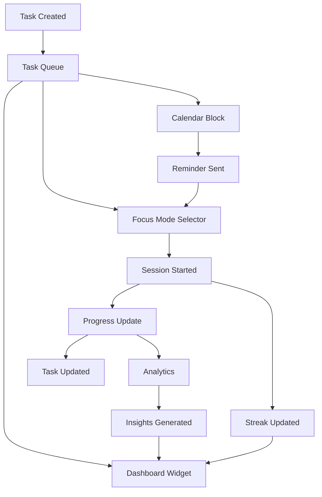

# Floe Platform - Product Roadmap & Implementation Plan

## Executive Summary
Floe is a productivity platform that seamlessly integrates task management, deep work sessions, and time blocking to help users achieve and maintain flow state. This document outlines the comprehensive feature set and implementation plan for creating a cohesive, intelligent productivity experience.

## Core Philosophy
**"Enter Flow, Stay in Flow"** - Every feature is designed to minimize cognitive overhead and maximize deep, focused work.

---

## 📋 Feature 1: Intelligent Task Management

### Current State
- Basic task CRUD operations
- Simple priority levels
- Rich text editor for task content
- Tag-based organization

### Target State

#### A. Task Hierarchy & Organization
- **Projects**: Top-level containers for related tasks
- **Subtasks**: Break down complex tasks into manageable pieces
- **Dependencies**: Link related tasks and set prerequisites
- **Contexts**: Group tasks by location, energy, or tool (@home, @computer, #low-energy)

#### B. Smart Task Queue
- **AI Prioritization**: Automatically order tasks based on:
  - Deadline proximity
  - Estimated effort vs available time
  - User's energy patterns
  - Task dependencies
- **Time Estimates**: Each task has duration estimate
- **Energy Levels**: Match tasks to energy (High/Medium/Low)
- **Batch Similar Tasks**: Group similar activities together

#### C. Multiple View Modes
1. **Today View**: What needs attention now
2. **Inbox**: Unprocessed/unsorted tasks  
3. **Projects View**: Hierarchical project structure
4. **Matrix View**: Eisenhower urgent/important quadrants
5. **Calendar View**: Tasks with deadlines visualized
6. **Board View**: Kanban-style workflow

#### D. Quick Capture & Natural Language
- **Global Hotkey** (Cmd/Ctrl+T): Add task from anywhere
- **Natural Language Processing**:
  - "Call John tomorrow at 2pm" → Creates task with deadline
  - "Weekly team meeting every Monday" → Creates recurring task
  - "Bug fix high priority due Friday" → Sets priority and deadline
- **Email to Task**: Forward emails to create tasks
- **Voice Input**: Dictate tasks (future enhancement)

#### E. Task Metadata
- Title (required)
- Description (rich text with Editor.js)
- Priority (Critical/High/Medium/Low)
- Energy Required (High/Medium/Low)
- Estimated Duration (minutes)
- Due Date & Time
- Tags (multiple)
- Project Assignment
- Attachments/Links
- Checklist Items
- Recurring Pattern

### Implementation Details
```typescript
interface Task {
  id: string;
  title: string;
  content: EditorContent;
  priority: 'critical' | 'high' | 'medium' | 'low';
  energy: 'high' | 'medium' | 'low';
  estimatedMinutes: number;
  dueDate?: Date;
  tags: string[];
  projectId?: string;
  parentTaskId?: string; // For subtasks
  dependencies?: string[]; // Task IDs that must complete first
  recurring?: RecurrencePattern;
  completed: boolean;
  completedAt?: Date;
  
  // Metrics
  actualMinutes?: number;
  sessionsCount: number;
  
  // AI-computed
  aiPriorityScore?: number;
  suggestedTimeSlot?: TimeSlot;
}
```

---

## 🧘 Feature 2: Deep Work Mode - The Focus Engine

### Current State
- Basic Pomodoro timer
- Session presets (25/5, 45/15, custom)
- Simple start/pause/stop controls
- Basic session history

### Target State

#### A. Pre-Session Planning
1. **Task Selection**:
   - Choose from prioritized queue
   - Quick-create focused task
   - Continue previous incomplete session
   
2. **Session Configuration**:
   - Session type (Pomodoro/Flow/Timeboxed)
   - Duration settings
   - Break preferences
   - Number of rounds

3. **Environment Setup**:
   - Background selection (images/colors)
   - Ambient sounds (rain, cafe, white noise)
   - Do Not Disturb mode activation
   - Website/app blocking

4. **Intention Setting**:
   - Session goal/outcome
   - Success metrics
   - Notes/context

#### B. During Session - Focus Mode

**Minimal UI Mode**:
```
┌─────────────────────────────────────┐
│                                     │
│         [Task Title]                │
│                                     │
│           25:00                     │
│         ████████░░                  │
│                                     │
│    [Pause]  [Note]  [Complete]     │
│                                     │
└─────────────────────────────────────┘
```

**Features During Focus**:
- **Distraction-free Interface**: Only essential elements
- **Ambient Environment**: Optional background/sounds
- **Quick Notes** (Cmd/Ctrl+N): Capture thoughts without breaking flow
- **Emergency Pause**: Preserves session state
- **Progress Indicators**: Subtle, non-distracting
- **Keyboard Shortcuts**: All controls accessible via keyboard

#### C. Break Time Management
- **Smart Break Suggestions**:
  - Stretching exercises
  - Eye rest reminders
  - Hydration prompts
  - Quick walk suggestions
- **Break Activities**:
  - Review session notes
  - Quick inbox processing
  - Meditation timer
  - Achievement celebration

#### D. Post-Session Review
1. **Session Summary**:
   - Time focused
   - Tasks completed
   - Notes captured
   - Distractions logged

2. **Reflection Prompts**:
   - Rate focus quality (1-5)
   - Log accomplishments
   - Identify blockers
   - Energy level after

3. **Next Steps**:
   - Mark task complete/partial
   - Schedule follow-up
   - Plan next session
   - Update time estimates

#### E. Session Templates
Pre-configured session types:
- **Morning Deep Dive**: 90-min focused work
- **Quick Sprint**: 25-min Pomodoro
- **Afternoon Focus**: 45-min with 15-min break
- **Evening Review**: 30-min planning session
- **Creative Flow**: 2-hour uninterrupted

### Session Data Model
```typescript
interface DeepWorkSession {
  id: string;
  taskId: string;
  userId: string;
  
  // Configuration
  type: 'pomodoro' | 'flow' | 'timeboxed';
  plannedDuration: number;
  breakDuration: number;
  rounds: number;
  
  // Environment
  background?: string;
  ambientSound?: string;
  
  // Execution
  startedAt: Date;
  endedAt?: Date;
  actualDuration: number;
  pauseCount: number;
  
  // Reflection
  focusRating?: 1 | 2 | 3 | 4 | 5;
  accomplishments?: string[];
  notes?: string;
  blockers?: string[];
  energyAfter?: 'energized' | 'neutral' | 'tired';
}
```

---

## 📅 Feature 3: Intelligent Calendar & Time Blocking

### Current State
- Basic calendar view
- Manual event creation
- Simple day/week/month views

### Target State

#### A. Time Blocking System
1. **Drag & Drop Interface**:
   - Drag tasks directly onto calendar
   - Resize blocks to adjust duration
   - Automatic conflict detection
   - Smart rescheduling suggestions

2. **Intelligent Scheduling**:
   - **Energy Matching**: Schedule high-energy tasks during peak times
   - **Deadline Awareness**: Auto-schedule based on due dates
   - **Buffer Time**: Add transitions between blocks
   - **Batch Processing**: Group similar tasks

3. **Protected Time**:
   - Deep work blocks (non-interruptible)
   - Recurring focus sessions
   - Meeting-free zones
   - Personal time boundaries

#### B. Calendar Views
1. **Day View**:
   - Hour-by-hour schedule
   - Time blocks with task details
   - Energy level indicators
   - Quick reschedule via drag

2. **Week View**:
   - 7-day overview
   - Deep work sessions highlighted
   - Deadline indicators
   - Workload balance meter

3. **Focus View**:
   - Only deep work sessions
   - Session statistics
   - Streak visualization
   - Optimal time patterns

4. **Planning View**:
   - Split screen: tasks + calendar
   - Drag to schedule
   - Time estimate totals
   - Availability indicator

#### C. Smart Features
1. **Auto-Scheduling**:
   ```
   Algorithm considers:
   - Task priority & deadlines
   - Energy patterns (from history)
   - Existing commitments
   - Preferred working hours
   - Break requirements
   ```

2. **Recurring Patterns**:
   - Daily standup blocks
   - Weekly planning sessions
   - Monthly reviews
   - Custom patterns

3. **Calendar Sync**:
   - Google Calendar integration
   - Outlook integration
   - iCal feed
   - Two-way sync

4. **Time Analytics**:
   - Planned vs actual time
   - Category breakdowns
   - Productivity patterns
   - Optimization suggestions

### Calendar Data Model
```typescript
interface TimeBlock {
  id: string;
  userId: string;
  
  // Core
  title: string;
  type: 'deep_work' | 'meeting' | 'break' | 'personal';
  startTime: Date;
  endTime: Date;
  
  // Associations
  taskId?: string;
  sessionId?: string;
  projectId?: string;
  
  // Properties
  isProtected: boolean;
  energyLevel?: 'high' | 'medium' | 'low';
  location?: string;
  
  // Recurrence
  recurring?: {
    pattern: 'daily' | 'weekly' | 'monthly' | 'custom';
    interval: number;
    endDate?: Date;
    exceptions?: Date[];
  };
  
  // Status
  status: 'scheduled' | 'in_progress' | 'completed' | 'missed';
  completionNotes?: string;
}
```

---

## 🔄 Unified User Experience

### A. Daily Workflow

#### Morning Routine (7:00 AM - 9:00 AM)
1. **Dashboard Welcome**:
   - Personalized greeting with weather/date
   - Today's primary focus (auto-selected)
   - Energy level check-in
   - Quick wins from yesterday

2. **Daily Planning** (Optional AI-Assisted):
   - Review auto-generated schedule
   - Adjust time blocks
   - Set daily intention
   - Confirm first deep work session

#### Work Sessions (9:00 AM - 5:00 PM)
1. **First Deep Work Block**:
   - Auto-starts based on schedule
   - Task pre-loaded from queue
   - Environment configured
   - DND activated

2. **Flow Maintenance**:
   - Smooth transitions between tasks
   - Break reminders
   - Energy check-ins
   - Quick capture for emerging tasks

3. **Afternoon Adjustment**:
   - Energy-based task switching
   - Schedule flexibility
   - Progress celebration
   - Next session prep

#### Evening Review (5:00 PM - 6:00 PM)
1. **Day Summary**:
   - Tasks completed
   - Time in deep work
   - Key accomplishments
   - Energy patterns

2. **Tomorrow Prep**:
   - Review tomorrow's schedule
   - Adjust if needed
   - Set morning task
   - Clear inbox

### B. Navigation Architecture

```
┌─────────────────────────────────────────────┐
│  Logo  Dashboard  Tasks  Focus  Calendar    │  <- Persistent top nav
├─────────────────────────────────────────────┤
│                                             │
│  [Current View Content]                     │
│                                             │
│  - Contextual actions                       │
│  - View-specific tools                      │
│  - Smart suggestions                        │
│                                             │
├─────────────────────────────────────────────┤
│  [Cmd+T] Add Task  [Space] Quick Focus     │  <- Global quick actions
└─────────────────────────────────────────────┘
```

### C. Keyboard Shortcuts (Global)
- `Cmd/Ctrl + T`: New task
- `Cmd/Ctrl + F`: Start focus session
- `Cmd/Ctrl + K`: Command palette
- `Cmd/Ctrl + /`: Keyboard shortcuts help
- `Space`: Quick start timer with selected task
- `Esc`: Return to dashboard
- `Tab`: Navigate between sections
- `1-4`: Jump to views (Dashboard/Tasks/Focus/Calendar)

### D. Command Palette
Universal action center (Cmd/Ctrl+K):
- Search tasks
- Start timer
- Create event
- Jump to view
- Change settings
- View shortcuts

---

## 🎨 Design System Adherence

### Visual Hierarchy
1. **Primary Actions** (Sunglow #E57873):
   - Start Focus Session
   - Add Task
   - Save Changes

2. **Secondary Actions** (Ghost buttons):
   - Edit
   - Schedule
   - Configure

3. **Tertiary Actions** (Text links):
   - View more
   - Settings
   - Help

### Component Patterns
1. **Cards**: All content in flat cards with subtle borders
2. **Forms**: Consistent input styling with clear labels
3. **Modals**: Centered, focused actions with overlay
4. **Tooltips**: Contextual help on hover
5. **Loading States**: Skeleton screens, not spinners
6. **Empty States**: Helpful guidance and actions

### Interaction Principles
- **Predictable**: Same patterns everywhere
- **Responsive**: Immediate feedback
- **Forgiving**: Undo capabilities
- **Accessible**: Keyboard navigable
- **Progressive**: Advanced features discoverable

---

## 📊 Data Integration Strategy

### Cross-Feature Data Flow



### State Management
```typescript
// Global State Structure
interface AppState {
  user: UserProfile;
  tasks: {
    items: Task[];
    filter: TaskFilter;
    sortBy: SortOption;
  };
  sessions: {
    active?: DeepWorkSession;
    history: DeepWorkSession[];
  };
  calendar: {
    events: TimeBlock[];
    view: 'day' | 'week' | 'month' | 'focus';
    selectedDate: Date;
  };
  ui: {
    theme: 'light' | 'dark';
    sidebarCollapsed: boolean;
    commandPaletteOpen: boolean;
  };
}
```

### Real-time Sync
- **Supabase Realtime**: Live updates across tabs/devices
- **Optimistic Updates**: Instant UI response
- **Conflict Resolution**: Last-write-wins with merge
- **Offline Support**: Local-first with sync queue

---

## 🚀 Implementation Phases

### Phase 1: Foundation & Architecture (Week 1)
- [ ] Setup global state management (Zustand/Redux)
- [ ] Implement command palette system
- [ ] Create unified navigation component
- [ ] Setup Supabase real-time subscriptions
- [ ] Build keyboard shortcut system
- [ ] Create base layout components
- [ ] Implement proper routing structure
- [ ] Setup error boundaries and logging

### Phase 2: Enhanced Task Management (Week 2)
- [ ] Create task hierarchy (projects/subtasks)
- [ ] Implement drag-and-drop (react-beautiful-dnd)
- [ ] Build multiple view modes (Today/Inbox/Matrix)
- [ ] Add natural language input parsing
- [ ] Create quick capture modal
- [ ] Implement task templates
- [ ] Add bulk operations
- [ ] Build smart prioritization

### Phase 3: Deep Work Mode 2.0 (Week 3)
- [ ] Link tasks to timer sessions
- [ ] Create session planning interface
- [ ] Build focus mode UI
- [ ] Implement session templates
- [ ] Add ambient backgrounds/sounds
- [ ] Create post-session review
- [ ] Build session analytics
- [ ] Implement DND mode

### Phase 4: Intelligent Calendar (Week 4)
- [ ] Create time blocking interface
- [ ] Implement drag-to-schedule
- [ ] Build recurring sessions
- [ ] Add smart auto-scheduling
- [ ] Create calendar sync adapters
- [ ] Build conflict detection
- [ ] Implement buffer time logic
- [ ] Create planning view

### Phase 5: Intelligence & Polish (Week 5)
- [ ] Implement AI prioritization
- [ ] Create insights dashboard
- [ ] Build onboarding flow
- [ ] Add tutorial system
- [ ] Implement achievements/gamification
- [ ] Create data export features
- [ ] Performance optimization
- [ ] Cross-browser testing

---

## 🎯 Success Metrics

### User Engagement
- Daily Active Users (DAU)
- Average session duration
- Tasks completed per user
- Deep work hours logged

### Productivity Metrics
- Task completion rate
- Average task cycle time
- Focus session quality ratings
- Streak maintenance rate

### Technical Metrics
- Page load time < 2s
- Time to Interactive < 3s
- API response time < 200ms
- Error rate < 0.1%

---

## 🔮 Future Enhancements (Post-MVP)

### AI & Intelligence
- GPT-powered task breakdown
- Smart meeting summaries
- Energy prediction models
- Workflow automation

### Collaboration
- Team workspaces
- Shared projects
- Real-time collaboration
- Comments and mentions

### Integrations
- Slack/Discord
- Notion/Obsidian
- GitHub/GitLab
- Email clients

### Mobile
- Native iOS/Android apps
- Widgets
- Watch complications
- Voice commands

### Analytics
- Advanced productivity insights
- Team analytics
- Goal tracking
- Custom reports

---

## 🛠 Technical Stack

### Frontend
- **Framework**: Next.js 15 with App Router
- **UI Library**: React 18
- **Styling**: Tailwind CSS with custom design system
- **State**: Zustand for global state
- **Forms**: React Hook Form + Zod
- **DnD**: React Beautiful DnD
- **Animations**: Framer Motion
- **Editor**: Editor.js
- **Calendar**: Custom-built with date-fns

### Backend
- **Database**: Supabase (PostgreSQL)
- **Auth**: Supabase Auth
- **Realtime**: Supabase Realtime
- **Storage**: Supabase Storage
- **Functions**: Edge Functions

### DevOps
- **Hosting**: Vercel
- **Monitoring**: Vercel Analytics
- **Error Tracking**: Sentry
- **CI/CD**: GitHub Actions

---

## 📝 Development Guidelines

### Code Standards
- TypeScript strict mode
- ESLint + Prettier
- Conventional commits
- Component testing (Vitest)
- E2E testing (Playwright)

### Performance Targets
- Lighthouse score > 95
- First Contentful Paint < 1.5s
- Cumulative Layout Shift < 0.1
- Bundle size < 200KB

### Accessibility
- WCAG 2.1 AA compliance
- Keyboard navigation
- Screen reader support
- High contrast mode

---

## 📅 Timeline

**Total Duration**: 5 weeks

- Week 1: Foundation
- Week 2: Task Manager
- Week 3: Deep Work
- Week 4: Calendar
- Week 5: Polish & Launch

**Launch Target**: End of Week 5

---

## 👥 Team & Responsibilities

**Development**:
- Full-stack implementation
- UI/UX refinements
- Testing & QA
- Performance optimization

**Design**:
- Maintain design system
- User testing
- Accessibility audit

**Product**:
- Feature prioritization
- User feedback integration
- Launch planning

---

*This is a living document and will be updated as development progresses.*

*Last Updated: 2025*
*Version: 1.0*